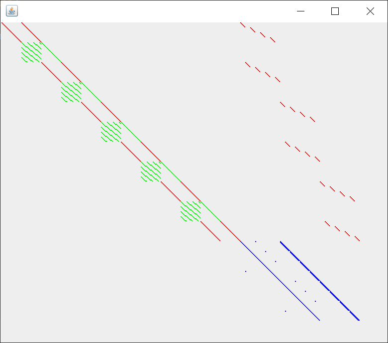
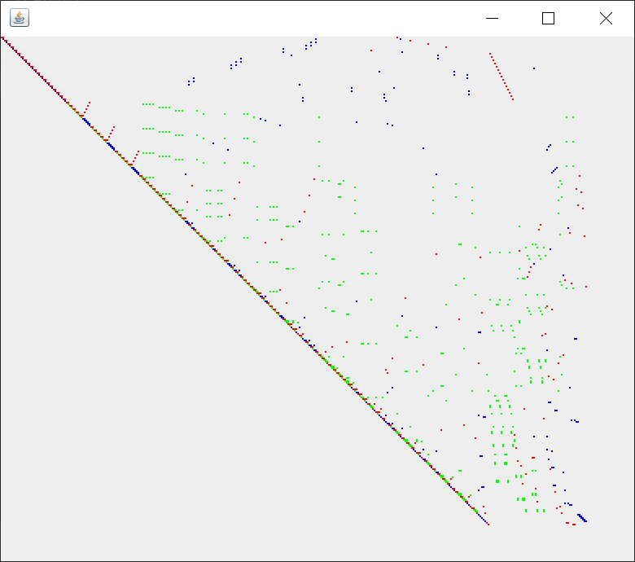

#Triangulation Algorithm
##Introduction
This is a program realization of the algorithm put out by the following paper:

Khovratovich, D., Biryukov, A., Nikolic, I.: Speeding up collision search for byte-oriented hash functions. In: Fischlin, M. (ed.) Topics in Cryptology – CT-RSA 2009. LNCS, vol. 5473, pp. 164–181. Springer, Heidelberg, Germany, San Francisco, CA, USA (Apr 20–24, 2009)

Personally I regard it as a proof of my study during the five months in NTU.

##Algorithm Realisation and Tests
The body of the algorithm is in the function Triangulation.work(). The classes Variable and Equation denote what they're named.

In the class Main, there are three test functions:
###trivialTest1()
Example 1 in the paper.
###trivialTest2()
A toy example to make the algorithm fail.
###AESTest()
5 round Rijndael-hash 320/160, also an example in the paper.
##Visualization
As for visualisation, I referred to the following codes:

https://blog.csdn.net/xietansheng/article/details/55669157

https://blog.csdn.net/weixin_31885977/article/details/114056771

The classes MyFrame$i$ and MyPanel$i$ ($i=1,2$) are both for visualisation. If $i=1$, the programme will display the equations before trianglulation; if $i=2$, it will display the equations after triangulation.

For AESTest(), I use the red color to denote AddRoundKey and SubBytes, the green color to denote ShiftRows and MixColumns, and the blue color to denote KeySchedule.

The results are as follows.

Before Triangulation:

AfterTriangulation:
